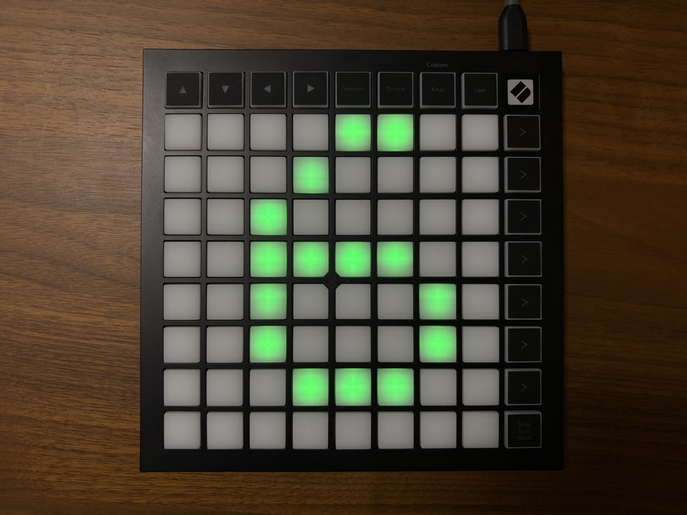

# launchpad-dice

A small [TrussC](https://github.com/TrussC-org/TrussC) demo for the Novation
**Launchpad Mini [MK3]**. It is a real example of the MIDI add-on
**[tcxMidi](https://github.com/TrussC-org/TrussC/tree/main/addons/tcxMidi)**.

Press any pad to roll a digital dice: the 8×8 grid shows a 1–6 that flickers
with roulette blips, decelerates over ~3 seconds, then lands on a random 1–6 and
plays a little tune for the result — a bright fanfare for **6** (jackpot) down to
a sad "womp-womp" for **1**. The screen mirrors the grid 1:1.



## What you need

- A **Novation Launchpad Mini Mk3**
- TrussC (with the `trusscli` tool)
- The `tcxMidi` add-on (it ships with TrussC and is listed in `addons.make`,
  so it is found automatically)

## Build & run

```bash
git clone git@github.com:tettou771/launchpad-dice.git
cd launchpad-dice
trusscli update
trusscli run
```

Plug in the Launchpad first; the app finds it, switches it into Programmer mode
and connects on its own. With no device it still starts — you can roll from the
computer keyboard too.

## How to play

| Control | What it does |
|---------|--------------|
| **Any pad / arrow** | Start a roll (ignored while already spinning). |
| **Any computer key** | Also starts a roll — handy without the device. |

The roll decelerates and lands on a random **1–6**. The landed digit is shown in
a colour that ramps from red (1) up to green (6), and each result has its own
tune.

## How it works (notes)

The device-specific code (Programmer-mode SysEx, the note/CC layout, the colour
palette) lives in `LaunchpadMk3.h`. The rest is split into small pieces:

- `DiceFont.h` — 5×7 digit glyphs for 1–6, drawn into the 8×8 pad grid.
- `DiceSound.h` — pre-built square-wave roulette blips plus one melody per
  result, so triggering during the roll only calls `play()` (no per-hit build).
- `PadGrid.h` — the colour buffer shared between the device and the screen mirror.
- `tcApp` — an Idle / Rolling / Result state machine. A single precise
  `callEveryAsync` clock decelerates the roll on the scheduler thread, while a
  mutex guards the state it shares with the MIDI input thread and `draw()`.

Input is **event-driven** (`MidiIn::onMessage` on libremidi's input thread), and
the roll's timing runs off a background scheduler rather than the render frame
rate, so the deceleration and blips stay smooth.

This demo reuses `LaunchpadMk3.h` and `PadGrid.h` from the
[Launchpad Mini Mk3 demo](https://github.com/TrussC-org/TrussC).

## License

[MIT](LICENSE)
